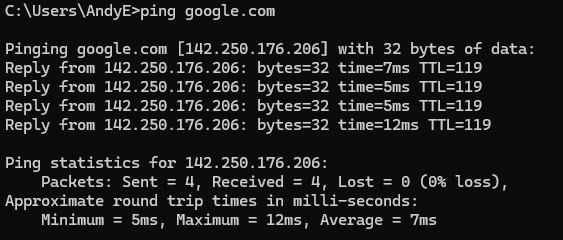
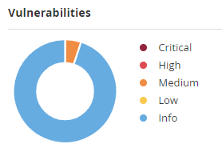
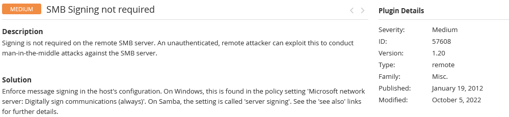
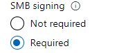
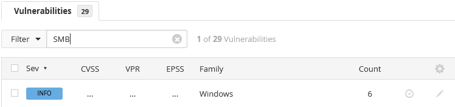

# Network Security Audit
- Use Nmap to discover open ports on TCP or UDP for your private/public IP address
- Learn what those ports are for in your network
- Use Nessus for vulnerability scanning on your IP address
- Solve and fix vulnerabilities in your network

### Download
- Nmap: https://nmap.org/download.html
- Nessus: https://www.tenable.com/downloads/nessus
  - When installing Nessus, select Nessus Essentials and register to get activation code

## Using NMAP

1. Used Zenmap program to do a quick scan on my private IP to view my non-closed TCP ports
   - Msrpc on port 135, which is a protocol for being a interface between programs to request a service.
   - Netbios-ssn on port 139, which is a protocol for File & Printer Sharing.
   - Microsoft-ds on port 445, which is for sharing resources like files/printers on SMB. *This will become important later*
   - MySQL on port 3306, which is used to connect to databases. 

     

2. Now, this is for my public IP non-closed TCP ports
   - SSH on port 22, this is for creating secured network connection through encryption between devices.
   - The remaining services are for Http/Https/http-proxy/https-alt, which relates to a client communicating and receive info from server.
   - Domain on port 53, this is the DNS server, which translates names to IP addresses. Ex: www.google.com -> 142.250.176.206 

3. The open state for a port means its looking for connections on that port. The filtered state for a port means a firewall is blocking the port.
4. Therefore, my computer is looking for connections to connect to databases, file or print sharing, communicating with servers, and translating domain names to IP addresses. Also, my SSH is filtered by my firewall which is being done by Windows Firewall.

## Using Nessus
1. Used Nessus Basic Network Scan on my private IP address and these were the results: 

2. Now, looking deeper into what were my vulnerabilities I found this! 

3. My medium severity vulnerability was for SMB Signing not required.

## Vulnerability Researched & Fixed
  
1. SMB (Server Message Block) Signing not required can allow an attacker to do man-in-the-middle attacks.
2. Man-in-the-middle attacks are where attackers can intercept messages between clients & servers and obfuscate who is being directly communicated with.
3. According to Microsoft, SMB Signing protects the connection because it prevents relay attacks and SMB will know if the data was manipulated.
(https://learn.microsoft.com/en-us/troubleshoot/windows-server/networking/overview-server-message-block-signing#how-smb-signing-protects-the-connection)

4. In order to update my SMB Signing to required, I had to download Windows Admin Center. This would allow me to update SMB Signing from "Not required" to "Required". 
   
5. Now, after updating this setting, I did another network scan with Nessus and it was no longer a severe vulnerability issue that was appearing. 
   
